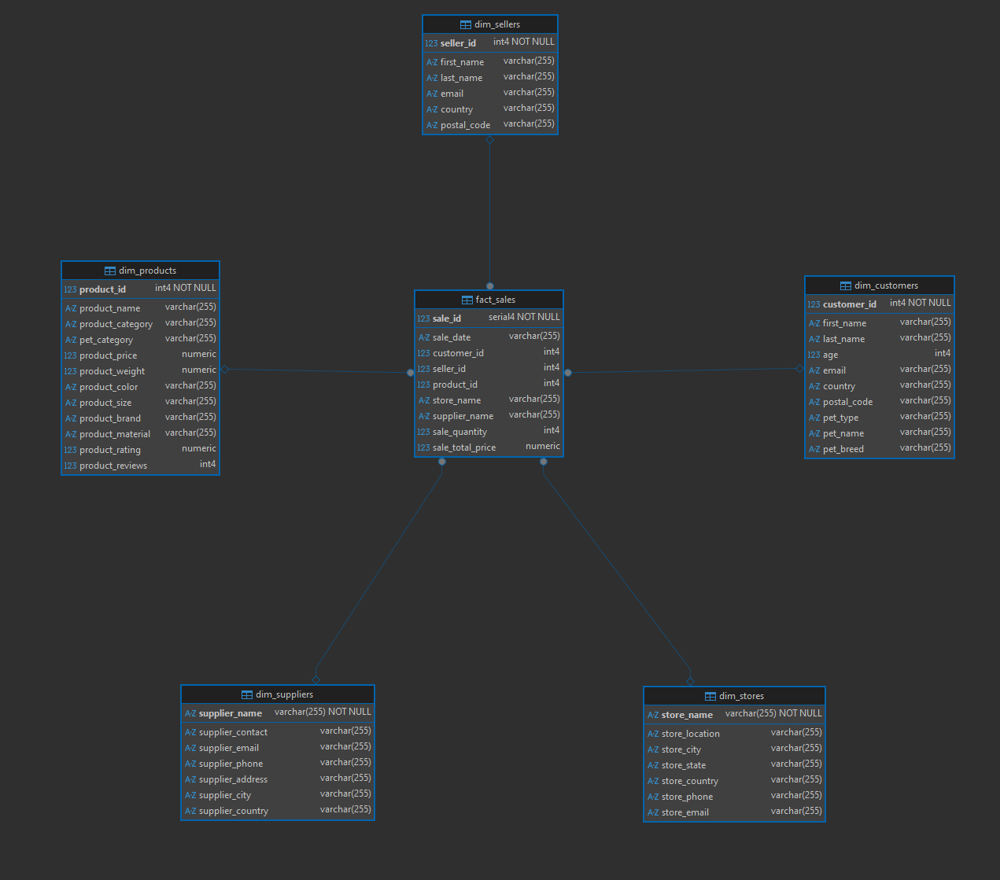

# Отчет по лабораторной работе №3: Потоковая обработка данных с помощью Apache Flink

## Введение
Данная работа посвящена изучению потоковой обработки данных (streaming processing). Основная цель — построить конвейер, который на лету считывает непрерывный поток данных из Apache Kafka, преобразует их в модель данных «Звезда» средствами **Apache Flink** и сохраняет итоговый результат в реляционную базу **PostgreSQL**.

---

## Что было сделано:

### 1. Эмуляция потока данных (Apache Kafka)
Был развернут брокер сообщений Kafka (в современном режиме KRaft, без использования Zookeeper). Чтобы получить поток данных, было написано Python-приложение (`producer.py`), которое считывает 10 исходных CSV-файлов, преобразует каждую строку в JSON и отправляет в топик `sales_topic`. Это позволяет эмулировать реальный источник данных, который постоянно генерирует новые события.

### 2. Потоковая трансформация через PyFlink
Был реализован скрипт `flink.py`, который работает внутри кластера Flink. Основные решения:
*   **Чтение из Kafka:** Flink подключается к топику и непрерывно считывает JSON-сообщения. Ошибки парсинга (например, пустые числа) автоматически игнорируются, чтобы не ронять процесс.
*   **Трансформация в «Звезду»:** Считанные данные разделяются на 5 таблиц измерений (покупатели, продавцы, товары и т.д.) и одну таблицу фактов (продажи).

### 3. Запись в PostgreSQL и сохранение целостности
При записи данных в реляционную базу из быстрого потока возникали проблемы с блокировками (deadlocks). Они были решены следующим образом:
*   **Логика UPSERT для измерений:** В измерениях ключи остались формата `INT`. Если в потоке попадается клиент, который уже есть в базе, Flink просто обновляет его данные, не создавая дублей.
*   **Автоинкремент для фактов:** Для таблицы фактов был использован тип `SERIAL`. СУБД сама выдает уникальный номер каждой новой продаже, благодаря чему сохраняется полная история (ровно 10 000 строк).
*   **Отложенное наложение связей:** Чтобы параллельные потоки не блокировали друг друга при проверке внешних ключей (Foreign Keys), данные заливаются в таблицы без связей. Связи накладываются уже после завершения загрузки данных.

---

## Результаты
*   **Непрерывная обработка:** Данные обрабатываются не пакетами, а сразу по мере их появления в Kafka.
*   **Автоматизация:** Весь стек (СУБД, брокер, Flink-кластер и продюсер) разворачивается одной командой. Запуск Flink-джобы также происходит автоматически через временный docker-контейнер.
*   **Целостность данных:** В базу успешно записано 10 000 фактов и соответствующие им измерения без дубликатов.

## Вывод
В результате выполнения работы были изучены принципы построения стриминговых конвейеров. Был получен практический опыт настройки связки Kafka + Flink + PostgreSQL. Также стало понятно, как работать с базами данных при потоковой нагрузке (использование UPSERT, работа с блокировками и внешними ключами).

## [Инструкция по запуску и проверке пайплайна](./lab_check.md)

